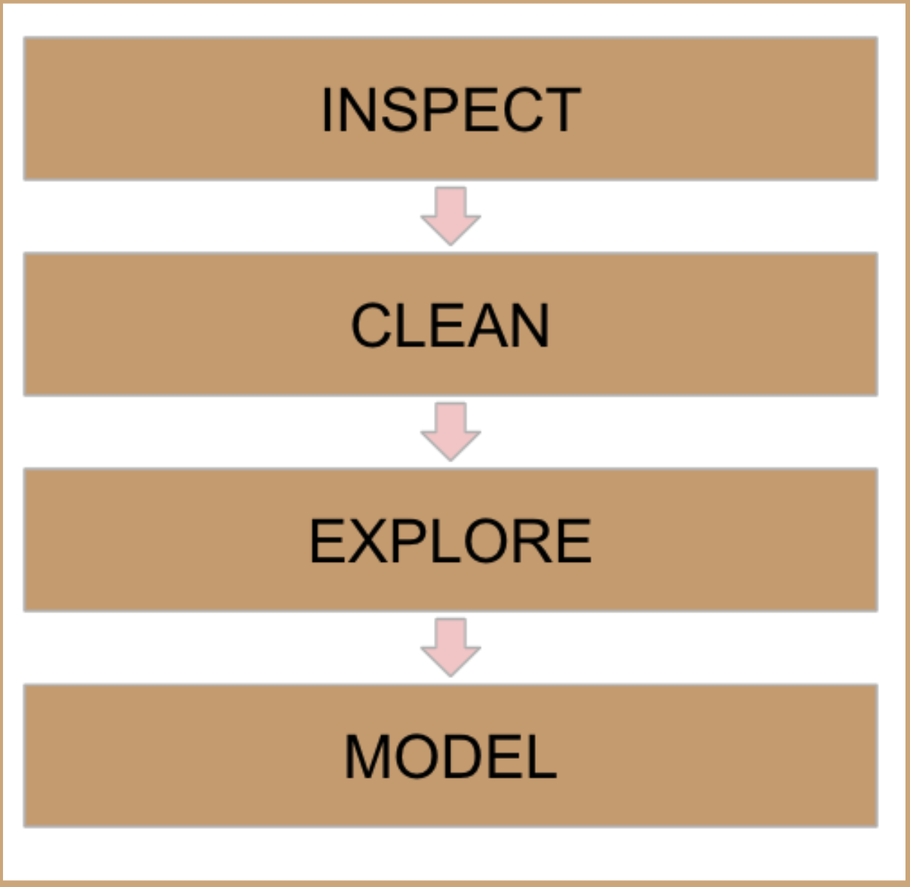
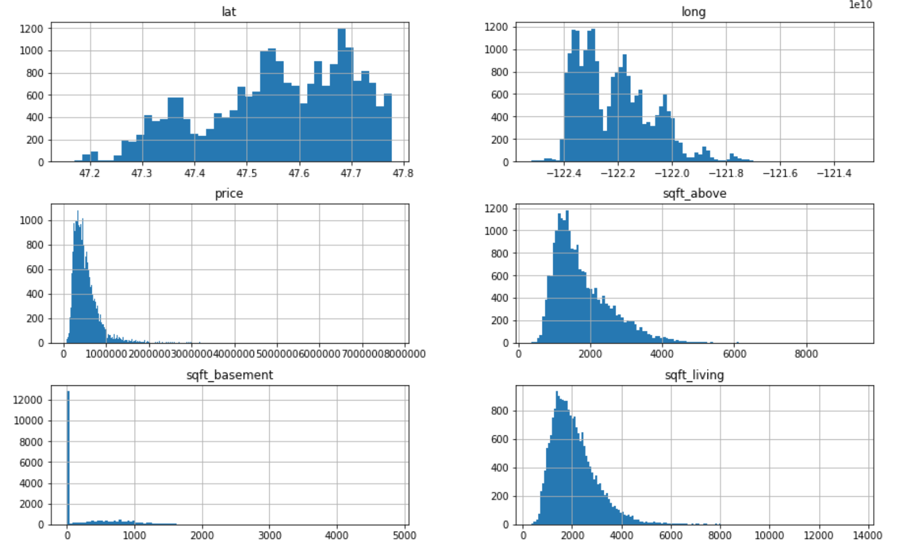
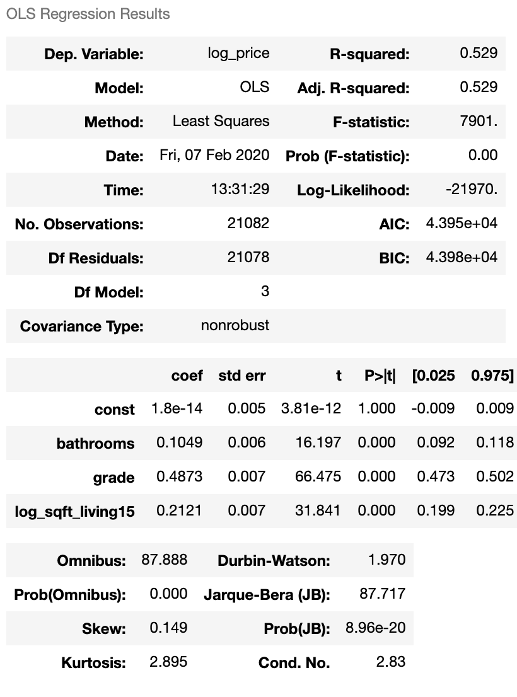
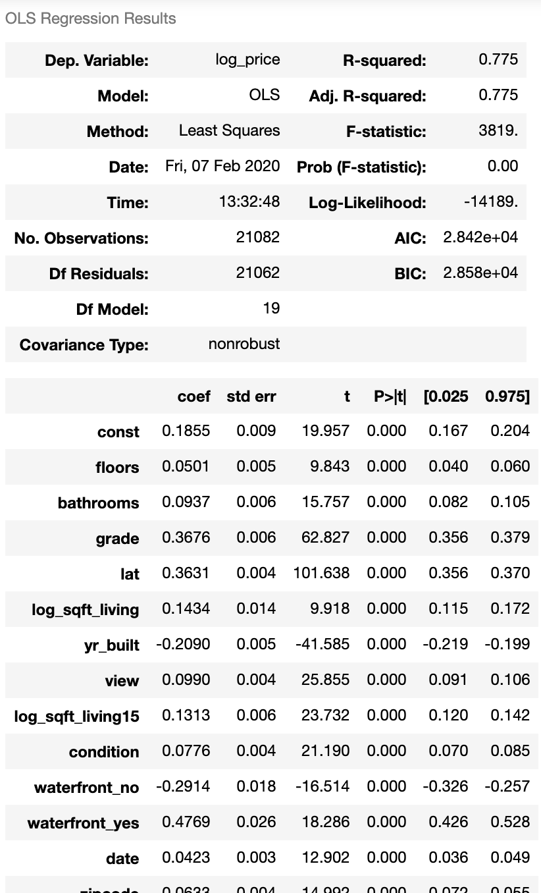

# Predicting Home Prices in King County 

## Table of contents
* [General Info](#general-info)
* [The Process](#the-process)
* [Screenshots](#screenshots)
* [Languages and Libraries](#languages-and-libraries)
* [Repository Elements](#repository-elements)
* [Contact](#contact)

## General Info
The repository contains my efforts in modeling sale prices for homes in King County, Washington.  I built prediction models by training them on a database containing approximately 20k records with each documenting the sale of a home during 2014-2015.  The models performed fairly with a lot of room for improvement in regards to accuracy and model assumptions.  

## The Process 

This project can be broken down into six steps. I imported the data from the source database and inspected its characteristics. Next, I cleaned and explored before I prepared the data for modeling.  Lastly, I fit the models on the features and evaluate their performances.       

## Screenshots

## Languages and Libraries
* Statsmodels 0.11.1
* Seaborn 0.10.1
* SciPy 1.4.1
* Scikit-learn 0.22.1
* Pandas 1.0.5
* NumPy 1.18.1
* Matplotlib 3.2.1

## Repository Elements
1. student.ipynb - Jupyter notebook containing home sale price analysis
2. kc_house_data.csv - CSV file containing housing data
3. README.md - Markdown document detailing the project and elements in the repository
4. img - Folder containing screenshot images used in README document and jupyter notebook
5. presentation.pdf - A non-technical walkthrough of the project and its results
6. column_names.md - Markdown file with descriptions for the housing dataset features

## Contact
Project created by John Nguyen.  Feel free to contact me with any questions, comments, or concerns at jdnguyen91@gmail.com.
